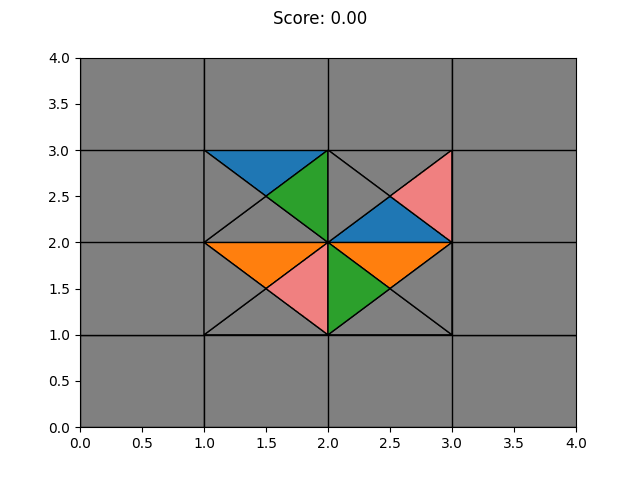

# Solving Eternity Puzzles using RL

Eternity is a puzzle known in computer science because of its huge
search space. It is a good environment to try and see the effects
of some search heuristics. A friend showed me this puzzle he has
to solve in a meta-heuristic course, and I decided to try to use
RL on this challenge.

## Presentation of the puzzle

The original game is played on a 16×16 board, where each piece
has 4 specific colours on its sides. The goal is then to place
each tiles on the board so that each tile's sides perfectly match
the colours of its neighbours.

The original game has in fact never been solved, but the best
partial solution has a total of 467 matches out of the 480
total perfect matches.

More can be found at the [wikipedia page](https://en.wikipedia.org/wiki/Eternity_II_puzzle).

## My Approach

An episode starts by randomly scrambling the pieces
and then the agent have a limited number of steps to
rearrange the pieces as best as possible.

I train a policy agent to swap pieces of the puzzle.
When swapping the pieces, the agent can rotate them
to properly align the sides with their neighbours.

The reward is based on the number of matching sides,
and can be given during the episode or only at the end.

To try my ideas faster, I start by solving easier
versions of the game, the simpler being a 2×2 board.

